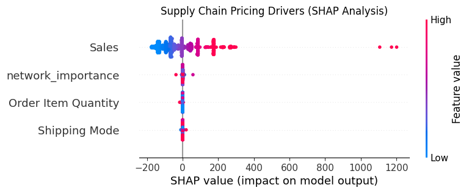

# Smart Logistics: AI-Powered Freight Cost Prediction Engine

 Project Overview
Logistics pricing is highly volatile and influenced by both shipment-specific attributes and global network congestion. This project implements a **Hybrid Advanced ML pipeline** to predict freight costs (fares) with high precision using the **DataCo Smart Supply Chain dataset (180k+ records)**.

## Key Technical Features
- **Hybrid Modeling:** Combined **XGBoost** (for tabular features like weight/quantity) with **Network/Graph Analysis** (to calculate city centrality and hub importance).
- **Network Awareness:** Utilized graph algorithms to identify "high-traffic hubs," adding a spatial dimension to the pricing engine that standard regression models miss.
- **Explainable AI (XAI):** Integrated **SHAP (SHapley Additive exPlanations)** to provide transparent, interpretable pricing decisions for supply chain stakeholders.

## Model Explainability (SHAP Analysis)
The model identified that **Order Sales** and **Network Hub Importance** were the primary drivers of freight cost. Below is the feature impact summary:

## Tech Stack
- **Languages:** Python
- **Machine Learning:** XGBoost, Scikit-Learn
- **Graph Analysis:** NetworkX (Network Centrality Modeling)
- **Interpretability:** SHAP
- **Visualization:** Matplotlib, Seaborn
- **Environment:** Google Colab with NVIDIA T4 GPU acceleration

## Business Impact
- **Precision Pricing:** Allows logistics firms to set competitive fares based on real-time network demand.
- **Strategic Insights:** Identified critical bottlenecks in the supply chain network by analyzing city-hub centrality.
